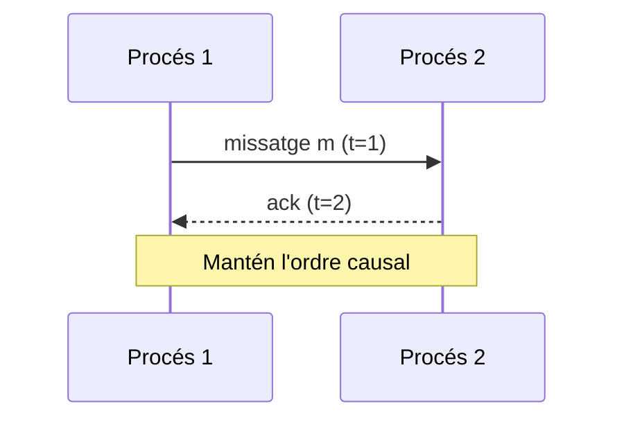
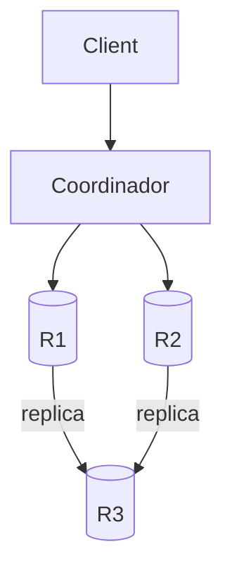
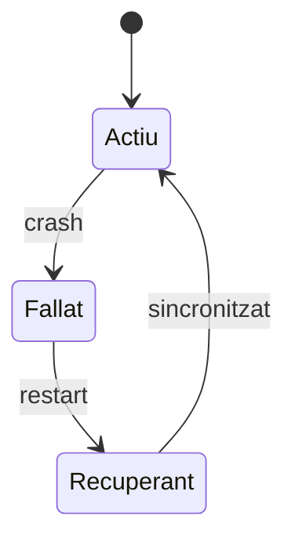

# Exemples Mermaid

Snippets bàsics per crear diagrames als apunts.

## Seqüència de missatges (Lamport)

## Grafs de dependència

## Diagrama d'estats (node)

Ajusta els textos i els nodes segons el context de cada tema.
